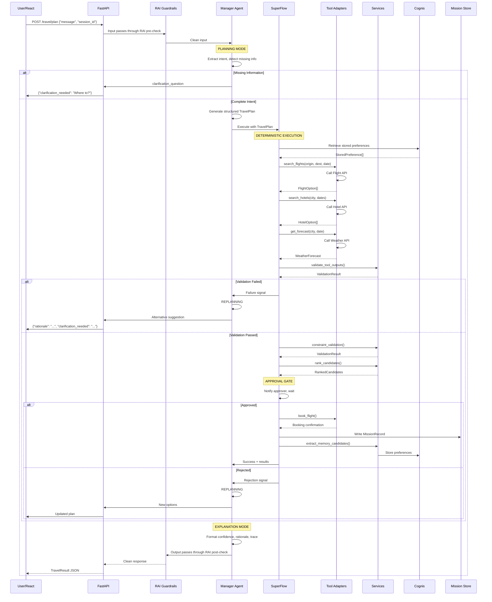
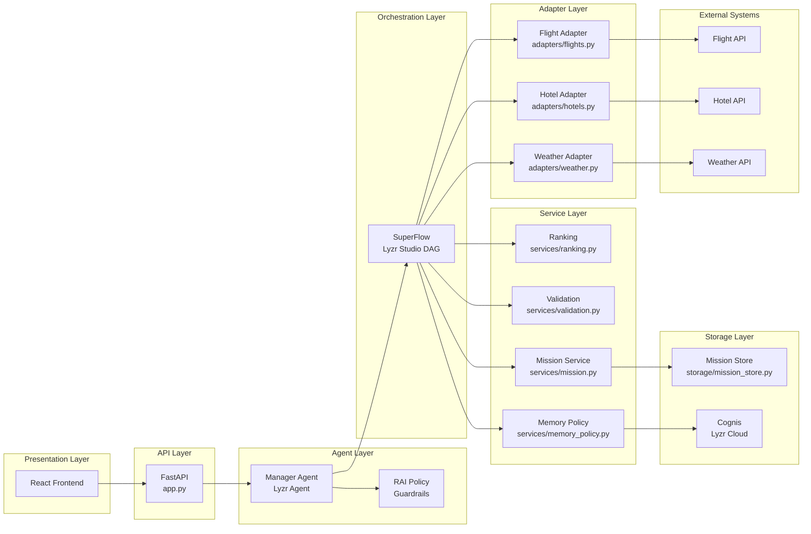
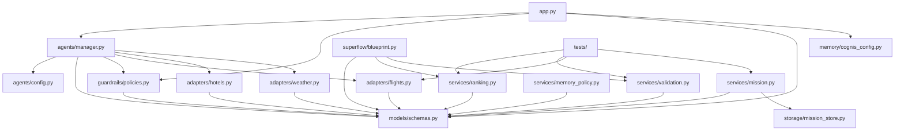

# Travel Agent — Lyzr Implementation Blueprint

> **Author:** Senior Staff Software Engineer, Lyzr Platform Architect  
> **Target:** 24-hour Lyzr Hackathon  
> **Status:** Finalized Architecture — Implementation Only  

---

## PART 1: Architecture → Lyzr Component Mapping

| My Component | Lyzr Component | Why | Built In |
|---|---|---|---|
| **Responsible AI (Pre-check)** | `RAIPolicy` with `toxicity_threshold`, `pii_detection`, `prompt_injection` | Checks input *before* the agent processes it — this is Lyzr's built-in RAI pipeline behavior. Confirmed in docs: "The Responsible and Safe AI module checks the input for PII, prompt injection attempts, toxicity, and agent entitlement before passing it to the Agent CPU." | ADK (`studio.create_rai_policy()`) or Studio UI |
| **Responsible AI (Post-check)** | Same `RAIPolicy` — Lyzr runs it again on output | Confirmed in docs: "A second pass checks the output for fairness and bias, applies Human-in-loop gates where configured, and re-checks for PII and toxicity." Same policy object handles both pre and post. | Same policy object, no extra work |
| **Manager Agent (Planning Mode)** | `studio.create_agent()` with `response_model=TravelPlan` | The Manager Agent is a single Lyzr Agent with structured output. Planning mode = the agent's `run()` call with `response_model` enforced. Confirmed: `response_model` parameter on `create_agent()`. | ADK |
| **Structured Travel Plan** | `response_model` Pydantic class on `create_agent()` | Confirmed: "Structured outputs let you define the exact shape of agent responses using Pydantic models." | ADK — Pydantic model |
| **Predefined Travel SuperFlow** | Lyzr **SuperFlow** (visual DAG builder in Studio) | Confirmed: "SuperFlow is a visual DAG-based workflow builder. You define the exact execution graph." The programmatic SDK for SuperFlow is **not confirmed** in docs — only the visual Studio builder is documented. Mark this as Studio-only or pseudocode SDK. | Studio UI (visual) |
| **Tool Adapter Layer** (Flight/Hotel/Weather API) | `agent.add_tool(function)` — Python functions | Confirmed: "Python functions as tools that the agent can execute." The tool function calls your external API and returns normalized data. | Code (your Python) |
| **Tool Output Validation** | Code node inside SuperFlow OR validation function in tool adapter | Must be deterministic Python code. Not an LLM call. The SuperFlow can have a validation node that runs your validation function. | Code |
| **Constraint Validation** | Code node inside SuperFlow | Deterministic checks: budget limit, date ordering, destination validity. Pure Python. | Code |
| **Deterministic Ranking Service** | Code node inside SuperFlow | Sort candidates by price, duration, rating — hardcoded algorithm. Not LLM. | Code |
| **Retry Policies** | SuperFlow node-level retry config | Confirmed: SuperFlow supports retry policies per node. In Studio, configure per-node retry count and backoff. | Studio UI |
| **Approval Gate** | SuperFlow **Human Approval Gate** node | Confirmed in docs: "You need human approval gates mid-workflow." Configurable in the SuperFlow visual builder. Not yet confirmed as an SDK method. | Studio UI |
| **Booking** | `agent.add_tool(book_trip)` called from a SuperFlow node OR a standalone Python function | The booking function runs as a deterministic tool call. It calls your external booking API. Confirmed: "Tools let agents execute Python functions to perform actions." | Code + Studio node |
| **Workflow State** | Built-in SuperFlow state tracking | Confirmed implicitly: SuperFlow tracks "executed node count" for pricing. State is managed automatically. | Built-in |
| **Execution Journal** | **Agent Trace** (Studio → Traces tab) | Confirmed: "Trace every agent run step by step, with latency metrics for each step." Every node execution in SuperFlow is automatically logged. | Built-in (Studio UI) |
| **Mission Record** | Custom storage (your code) + `response.metadata` | Lyzr does **not** have a "Mission Record" concept. You store this yourself — either in a local DB, file, or the `metadata` dict on `AgentResponse`. Confirmed: `AgentResponse.metadata` exists. | Code |
| **Memory Policy** | `agent.add_memory(max_messages)` + Cognis configuration | Confirmed: `add_memory(max_messages)` sets session memory. Cognis is the cross-session memory layer. Confirmed: "Cognis automatically stores interactions, retrieves relevant context, updates stale memories." | ADK + Studio toggle |
| **Cognis** | Cognis (Lyzr's cross-session memory) | Confirmed: "Cognis is a production-grade memory module that requires zero configuration. Cognis automatically stores interactions, retrieves relevant context." Stores *only reusable preferences* per your architecture rule. | Studio: "Cross-session memory" toggle |
| **Manager Agent (Explanation Mode)** | Same `agent` object — different call or same call with different instructions | The same agent handles both planning and explanation. The agent's instructions tell it to output both plan + explanation in the structured response. | ADK |
| **Final Response** | `AgentResponse.response` + `AgentResponse.metadata` | Confirmed: `response.response` (text), `response.session_id`, `response.metadata` (dict with tokens, timing). | Built-in |

---

## PART 2: Lyzr Interface Explanation

### 2.1 Studio UI

**Purpose:** Visual web interface for building, testing, deploying, and monitoring agents. Primary UI layer on top of the Lyzr Agent Framework.

**Advantages:**
- Zero code required for agent creation
- Visual SuperFlow DAG builder (drag, connect, configure)
- Built-in monitoring (Traces, Transcripts, Reports)
- Built-in Agent Eval (auto-generate test cases, score, harden)
- One-click Deploy → instant REST endpoint
- Role-based team management
- Cognis toggle (enable cross-session memory with one click)
- Version control for agents

**Limitations:**
- Cannot express complex deterministic logic (ranking algorithms, validation formulas)
- Cannot call arbitrary internal APIs without going through the tool adapter pattern
- Cannot customize the response processing pipeline beyond what Studio exposes
- SuperFlow approval gates require manual interaction in the Studio UI

**When to use it:**
- Initial agent prototyping
- Building the SuperFlow DAG visually
- Monitoring and debugging agent runs via Traces
- Running Agent Eval test suites
- Team governance and role management

**Which parts of my architecture belong there:**
- SuperFlow visual construction (node connections, retry config, approval gate placement)
- Cognis toggle (enable cross-session memory)
- RAI policy creation (or do it via ADK — equivalent)
- Evaluation test case management
- Trace inspection and debugging
- Deployment (click Deploy → get REST endpoint)

**Which parts should NEVER be implemented there:**
- Deterministic ranking algorithm — write this in Python code
- Tool adapter implementations (Flight/Hotel/Weather API clients) — write in `adapters/`
- Mission Record storage — implement in your `storage/` module
- Validation logic (tool output validation, constraint validation) — implement in `validation/`
- Memory policy decisions (what gets stored in Cognis vs. not) — configure via ADK or code

---

### 2.2 ADK (Python)

**Purpose:** Python SDK for building and managing agents programmatically.

**Advantages:**
- Full control over agent configuration
- Type-safe with Pydantic models
- Can add arbitrary Python functions as tools
- Can manage agents in CI/CD pipelines
- Fine-grained control over retry logic, error handling
- All Studio capabilities are accessible via ADK (except SuperFlow visual builder)

**Limitations:**
- SuperFlow visual DAG **cannot** be built via ADK — only the Studio UI provides the visual builder
- Some features (Cognis fine-tuning, certain RAI configs) may only be available in Studio
- Documentation is evolving — verify specific API calls against the installed SDK version

**When to use it:**
- Writing tool adapter functions (Flight/Hotel/Weather API calls)
- Creating the Manager Agent with structured output
- Attaching RAI guardrails
- Adding memory and Cognis configuration
- Building the FastAPI entry point for your application
- Writing deterministic validation/ranking code

**Which parts of my architecture belong there:**
- Manager Agent creation (`studio.create_agent(...)`)
- Tool adapter registration (`agent.add_tool(search_flights)`)
- RAI policy creation and attachment
- Structured output model (Pydantic `TravelPlan`)
- `agent.run()` calls from your FastAPI endpoints
- Cognis configuration (via `memory` parameter)
- Mission Record writing (your custom code)

**Which parts should NEVER be implemented there:**
- SuperFlow DAG construction (use Studio UI)
- Deterministic ranking algorithm (belongs in your `ranking/` module — called by the SuperFlow code node)
- External API client logic (belongs in `adapters/` — imported by tool functions)

---

### 2.3 REST API

**Purpose:** HTTP access to all Lyzr agent endpoints from any language.

**Advantages:**
- Language-agnostic (works with any HTTP client)
- No SDK dependency runtime
- OpenAPI 3.1 compliant
- Call from frontend, mobile apps, or backend services

**Limitations:**
- No streaming control beyond what the endpoint provides
- Cannot register custom tool functions at runtime (must be pre-configured via Studio or ADK)
- No type safety (responses are JSON, not Pydantic)

**When to use it:**
- Calling deployed agents from a React frontend
- Calling from non-Python services (Node.js Go service, mobile app)
- Integrating with API gateways or service meshes
- Quick testing with curl/Postman

**Which parts of my architecture belong there:**
- Final call from frontend to the deployed agent
- The actual invocation is: `POST /v3/agent/{id}/chat` with `{"message", "session_id"}`

**Which parts should NEVER be implemented there:**
- Tool adapter implementation
- Ranking or validation logic
- Manager Agent creation

---

### 2.4 SuperFlow Builder (Studio Visual)

**Purpose:** Visual DAG-based workflow builder for deterministic multi-step orchestration.

**Advantages:**
- Visual — see the entire workflow as a connected graph
- Per-node retry configuration
- Human Approval Gate nodes (email notification + approve/reject)
- Cron scheduling
- Webhook triggers
- Built-in state tracking and execution journal
- Exactly-once execution guarantees

**Limitations:**
- **Cannot** express arbitrary Python logic directly in nodes (use Code Nodes)
- **Not** available as a programmatic SDK (Studio UI only — *likely* pattern but not confirmed in docs)
- Approval gates require the approver to visit the Studio UI (or receive email)

**When to use it:**
- Constructing the execution DAG for your travel workflow
- Wiring tool nodes (Flight → Hotel → Weather → Validation → Ranking → Approval → Booking)
- Configuring retry policies per node (3 retries for flight search, 2 for weather)
- Adding the Human Approval Gate before booking
- Adding a Code Node for deterministic ranking

**Which parts of my architecture belong there:**
- Flight Search node
- Hotel Search node
- Weather node
- Tool Output Validation node
- Constraint Validation node
- Ranking Code node (calls your `ranking/rank_candidates()` function)
- Approval Gate node
- Booking node

**Which parts should NEVER be implemented there:**
- The actual ranking algorithm implementation (write in Python, called from the Code node)
- The actual tool adapter implementations (write in Python, referenced by tool nodes)
- Mission Record storage logic

---

## PART 3: VS Code Project Structure

```
travel-agent/
├── .env                           # LYZR_API_KEY + API keys for flight/hotel/weather
├── .gitignore
├── requirements.txt               # lyzr-adk, fastapi, uvicorn, pydantic, python-dotenv
├── app.py                         # FastAPI entry point — handles HTTP requests, calls Manager Agent
│
├── agents/
│   ├── __init__.py
│   ├── manager.py                 # Manager Agent factory — creates, configures, and returns the agent
│   └── config.py                  # Agent configuration constants (name, provider, role, goal, instructions)
│
├── superflow/
│   ├── __init__.py
│   └── blueprint.py               # SuperFlow DAG definition — node wiring, retry config, approval gate
│                                  # NOTE: This file documents the DAG for Studio construction.
│                                  # SuperFlow is built visually in Studio, not via SDK.
│
├── models/
│   ├── __init__.py
│   ├── schemas.py                 # All Pydantic models: TravelPlan, TravelIntent, Mission, etc.
│   ├── contracts.py               # Interface contracts: ToolAdapter I/O, Ranking I/O, etc.
│   └── enums.py                   # Enums: TravelClass, MissionStatus, ApprovalDecision
│
├── adapters/
│   ├── __init__.py
│   ├── flights.py                 # Flight API client — search(), book(), cancel()
│   ├── hotels.py                  # Hotel API client — search(), reserve()
│   └── weather.py                 # Weather API client — forecast()
│
├── services/
│   ├── __init__.py
│   ├── ranking.py                 # Deterministic ranking algorithm — pure Python, no LLM
│   ├── validation.py              # Tool output validation + constraint validation
│   ├── memory_policy.py           # Decides what to store in Cognis vs. discard
│   └── mission.py                 # Mission Record CRUD operations
│
├── storage/
│   ├── __init__.py
│   ├── mission_store.py           # In-memory or file-based Mission Record storage
│   └── execution_journal.py       # Local execution journal (optional — Lyzr Trace is primary)
│
├── guardrails/
│   ├── __init__.py
│   └── policies.py                # RAI policy factory — create_policy()
│
├── memory/
│   ├── __init__.py
│   └── cognis_config.py           # Cognis configuration (memory count, cross-session toggle)
│
├── observability/
│   ├── __init__.py
│   └── tracing.py                 # Optional custom logging wrapper around Lyzr Trace
│
├── tests/
│   ├── __init__.py
│   ├── test_ranking.py            # Unit tests for deterministic ranking
│   ├── test_validation.py         # Unit tests for validation logic
│   ├── test_adapters.py           # Unit tests for API adapters (mocked)
│   ├── test_mission.py            # Unit tests for Mission Record
│   └── test_eval_scenarios.py     # Agent Eval test scenarios (for Studio import)
│
└── deployment/
    ├── __init__.py
    └── config.py                  # Deployment config: API keys, environment, Studio agent ID
```

### Folder Responsibilities

| Folder | Responsibility |
|---|---|
| `agents/` | Manager Agent lifecycle — creation, configuration, attachment of tools/policies/memory |
| `superflow/` | Documents the SuperFlow DAG (built in Studio). The `blueprint.py` file is a spec file, not executable — it records node definitions, connections, retry settings for reproducibility |
| `models/` | All data contracts — Pydantic schemas for structured output, tool I/O, storage, contracts |
| `adapters/` | External API integrations. Each file wraps a third-party API (flight, hotel, weather) into a deterministic Python function that the agent can call via `add_tool()` |
| `services/` | Core deterministic business logic — ranking, validation, memory policy, mission records. Pure Python, zero LLM calls |
| `storage/` | Local persistence for Mission Records and execution journal. In hackathon, use in-memory dict or JSON file |
| `guardrails/` | RAI policy factory — creates and returns the `RAIPolicy` object |
| `memory/` | Cognis configuration — how many messages to remember, cross-session toggle |
| `observability/` | Optional custom logging. Lyzr Trace covers most needs automatically |
| `tests/` | Unit tests for all deterministic code. Agent Eval scenarios documented here for Studio import |
| `deployment/` | Environment-specific config (dev vs. prod API keys, URLs) |

---

## PART 4: File-by-File Mapping

### `app.py`

| Field | Value |
|---|---|
| **Purpose** | FastAPI application entry point. Single endpoint: `POST /travel/plan`. Validates input, runs the Manager Agent, returns structured response |
| **Inputs** | `POST /travel/plan` body: `{"message": str, "session_id": str | None, "user_id": str | None}` |
| **Outputs** | JSON: `{"plan": TravelPlan, "confidence": float, "session_id": str, "trace_id": str, "rationale": str}` |
| **Dependencies** | `agents/manager.py` (get Manager Agent instance), `guardrails/policies.py` (RAI policy) |
| **Used by** | Frontend (React), curl, any HTTP client |

### `agents/manager.py`

| Field | Value |
|---|---|
| **Purpose** | Creates and returns the fully-configured Manager Agent singleton. Agent has tools, RAI policy, memory, structured output, and evaluation features attached |
| **Inputs** | None (reads config from `agents/config.py`, keys from `.env`) |
| **Outputs** | `lyzr.Agent` instance — ready to call `.run()` |
| **Dependencies** | `models/schemas.py` (TravelPlan), `guardrails/policies.py` (RAI policy), `adapters/flights.py`, `adapters/hotels.py`, `adapters/weather.py`, `agents/config.py` |
| **Used by** | `app.py` |

### `agents/config.py`

| Field | Value |
|---|---|
| **Purpose** | Constants for agent creation — name, provider, role, goal, instructions |
| **Inputs** | None |
| **Outputs** | Dict of configuration values |
| **Dependencies** | None |
| **Used by** | `agents/manager.py` |

### `superflow/blueprint.py`

| Field | Value |
|---|---|
| **Purpose** | **Specification document** for the Studio SuperFlow builder. Lists every node, its inputs/outputs, retry policy, and connection wiring. Not executable — used to reproduce the flow in Studio |
| **Inputs** | N/A (spec file) |
| **Outputs** | N/A (spec file) |
| **Dependencies** | N/A |
| **Used by** | Developer constructing the SuperFlow in Studio |

### `models/schemas.py`

| Field | Value |
|---|---|
| **Purpose** | All Pydantic data models used across the system |
| **Inputs** | Python type definitions |
| **Outputs** | Pydantic BaseModel classes |
| **Dependencies** | `pydantic` |
| **Used by** | Everything — `agents/manager.py`, `services/`, `adapters/`, `app.py` |

See **PART 7** for complete model definitions.

### `models/contracts.py`

| Field | Value |
|---|---|
| **Purpose** | TypedDict or Protocol classes defining interface contracts between components |
| **Inputs** | N/A |
| **Outputs** | Type annotations |
| **Dependencies** | `models/schemas.py` |
| **Used by** | All modules for type safety |

See **PART 8** for complete contracts.

### `models/enums.py`

| Field | Value |
|---|---|
| **Purpose** | Enum classes for status codes, types, decisions |
| **Inputs** | N/A |
| **Outputs** | Enum classes |
| **Dependencies** | None |
| **Used by** | `models/schemas.py`, `services/`, `storage/` |

### `adapters/flights.py`

| Field | Value |
|---|---|
| **Purpose** | Flight API client. Two functions: `search_flights()` and `book_flight()`. Both are deterministic Python functions that call an external API and normalize the response |
| **Inputs** | `search_flights(origin, dest, date, passengers, cabin_class)` |
| **Outputs** | `list[FlightOption]` — normalized flight data with price, duration, airline, flight number |
| **Dependencies** | `models/schemas.py`, external flight API (Amadeus, Skyscanner, etc.) |
| **Used by** | Registered as tool via `agent.add_tool()` in `agents/manager.py` |

### `adapters/hotels.py`

| Field | Value |
|---|---|
| **Purpose** | Hotel API client. Function: `search_hotels()`. Deterministic Python function |
| **Inputs** | `search_hotels(city, check_in, check_out, guests, max_price)` |
| **Outputs** | `list[HotelOption]` |
| **Dependencies** | `models/schemas.py`, external hotel API |
| **Used by** | `agent.add_tool()` in `agents/manager.py` |

### `adapters/weather.py`

| Field | Value |
|---|---|
| **Purpose** | Weather API client. Function: `get_forecast()`. Deterministic Python function |
| **Inputs** | `get_forecast(city, date)` |
| **Outputs** | `WeatherForecast` — temperature, condition, precipitation chance |
| **Dependencies** | `models/schemas.py`, external weather API |
| **Used by** | `agent.add_tool()` in `agents/manager.py` |

### `services/ranking.py`

| Field | Value |
|---|---|
| **Purpose** | Deterministic ranking algorithm. Sorts flight/hotel candidates by weighted score: price × 0.4 + duration × 0.3 + rating × 0.3. **No LLM calls.** |
| **Inputs** | `list[FlightOption]`, `list[HotelOption]`, `TravelIntent` (budget, preferences) |
| **Outputs** | `RankedCandidates` — sorted lists with score, rank, rationale |
| **Dependencies** | `models/schemas.py` |
| **Used by** | Called from SuperFlow Code Node (or directly from Manager Agent's tool flow) |

### `services/validation.py`

| Field | Value |
|---|---|
| **Purpose** | Deterministic validation of tool outputs and constraints |
| **Inputs** | Tool output (raw), `TravelIntent` (constraints) |
| **Outputs** | `ValidationResult` — passed/failed per check, error messages |
| **Dependencies** | `models/schemas.py` |
| **Used by** | Called from SuperFlow Validation Node |

### `services/memory_policy.py`

| Field | Value |
|---|---|
| **Purpose** | Determines what gets stored in Cognis. Per your architecture: **only reusable preferences**. Filters: extract preferences (seat preference, hotel star rating, budget range) and discard ephemera (specific dates, flight numbers) |
| **Inputs** | `TravelPlan` (the structured output from Manager Agent) |
| **Outputs** | `MemoryCandidate` — list of preference key-value pairs to store in Cognis |
| **Dependencies** | `models/schemas.py` |
| **Used by** | Called after Manager Agent explanation, before Cognis write |

### `services/mission.py`

| Field | Value |
|---|---|
| **Purpose** | Mission Record CRUD. Creates, reads, and updates mission records that capture the entire travel planning session |
| **Inputs** | `Mission` — user intent, TravelPlan, approval status, execution events |
| **Outputs** | `MissionRecord` — persisted mission with trace ID |
| **Dependencies** | `models/schemas.py`, `storage/mission_store.py` |
| **Used by** | `app.py` after response, SuperFlow booking node on completion |

### `storage/mission_store.py`

| Field | Value |
|---|---|
| **Purpose** | Backend for Mission Record persistence. In hackathon: in-memory dict. For production: SQLite/PostgreSQL |
| **Inputs** | CRUD operations |
| **Outputs** | `MissionRecord` |
| **Dependencies** | `models/schemas.py` |
| **Used by** | `services/mission.py` |

### `guardrails/policies.py`

| Field | Value |
|---|---|
| **Purpose** | RAI policy factory. Creates the `RAIPolicy` object with PII blocking, toxicity threshold, prompt injection detection |
| **Inputs** | None (uses constants) |
| **Outputs** | `RAIPolicy` object |
| **Dependencies** | `lyzr` (PIIType, PIIAction, SecretsAction) |
| **Used by** | `agents/manager.py` |

### `memory/cognis_config.py`

| Field | Value |
|---|---|
| **Purpose** | Configuration for Cognis memory: how many messages to remember, cross-session toggle, preference extraction guidance |
| **Inputs** | None |
| **Outputs** | Config dict |
| **Dependencies** | None |
| **Used by** | `agents/manager.py` |

### `observability/tracing.py`

| Field | Value |
|---|---|
| **Purpose** | Optional custom tracing wrapper. Lyzr Trace covers all agent runs automatically. This module adds application-level logging (request IDs, timing, errors) |
| **Inputs** | Log events |
| **Outputs** | Structured logs |
| **Dependencies** | Python `logging` |
| **Used by** | `app.py` |

---

## PART 5: Request Flow

```
User request (JSON over HTTP)
│
│   FastAPI route: POST /travel/plan
│
▼
┌─────────────────────────────────────────────────────────────────────┐
│  app.py                                                             │
│  - Validates input (message required, session_id optional)          │
│  - Wraps in TravelIntent model                                      │
│  - Passes to run_agent()                                            │
└─────────────────────────────────────────────────────────────────────┘
│
▼
┌─────────────────────────────────────────────────────────────────────┐
│  RAI Pre-check (Lyzr built-in)                                      │
│  - RAIPolicy checks: toxicity, PII, prompt injection                │
│  - If blocked → return error response immediately                  │
│  - If passed → pass through to Manager Agent                        │
└─────────────────────────────────────────────────────────────────────┘
│
▼
┌─────────────────────────────────────────────────────────────────────┐
│  Manager Agent — Planning Mode (Lyzr Agent)                         │
│  - Runs on LLM with response_model=TravelPlan                       │
│  - Extracts: destination, dates, budget, preferences                │
│  - If missing info → asks clarifying questions (replanning)         │
│  - Delegates tool calls to registered tools (flight/hotel/weather)  │
│  - Returns Structured TravelPlan (Pydantic)                         │
│    but ALSO sends the plan to SuperFlow for deterministic execution │
└─────────────────────────────────────────────────────────────────────┘
│
▼
┌─────────────────────────────────────────────────────────────────────┐
│  Structured TravelPlan (Pydantic model)                              │
│  - Used as input to SuperFlow execution                             │
│  - Contains: intent, constraints, preliminary options               │
└─────────────────────────────────────────────────────────────────────┘
│
▼
┌─────────────────────────────────────────────────────────────────────┐
│  Predefined Travel SuperFlow (Lyzr Studio)                          │
│                                                                      │
│  Node 1: Retrieve Cognis preferences → inject into context          │
│  Node 2: Flight Search → call adapter, validate output              │
│  Node 3: Hotel Search → call adapter, validate output               │
│  Node 4: Weather → call adapter, validate output                    │
│  Node 5: Tool Output Validation → check schema, completeness        │
│  Node 6: Constraint Validation → budget, date ordering, feasibility │
│  Node 7: Deterministic Ranking → score + sort candidates            │
│  Node 8: Approval Gate → wait for human approve/reject              │
│  Node 9: Booking → call book_flight() adapter                       │
│  Node 10: Mission Record → store final record                       │
│  Node 11: Cognis Write → store reusable preferences only            │
└─────────────────────────────────────────────────────────────────────┘
│
▼
┌─────────────────────────────────────────────────────────────────────┐
│  Manager Agent — Explanation Mode (same Lyzr Agent)                 │
│  - Receives deterministic results from SuperFlow                    │
│  - Formats final response with: confidence, rationale, trace        │
└─────────────────────────────────────────────────────────────────────┘
│
▼
┌─────────────────────────────────────────────────────────────────────┐
│  RAI Post-check (Lyzr built-in)                                     │
│  - Same RAIPolicy runs on output                                    │
│  - Checks: bias, toxicity, PII re-check                             │
└─────────────────────────────────────────────────────────────────────┘
│
▼
┌─────────────────────────────────────────────────────────────────────┐
│  Final Response (JSON)                                              │
│  {                                                                   │
│    "plan": TravelPlan structured data,                               │
│    "confidence": 0.92,                                               │
│    "session_id": "abc123",                                           │
│    "trace_id": "trace_xyz",                                          │
│    "rationale": "Selected based on budget $x, rating > y, ..."      │
│  }                                                                   │
└─────────────────────────────────────────────────────────────────────┘
```

### Transition Details

1. **FastAPI → RAI:** Lyzr applies the `RAIPolicy` at the framework level before the agent sees the input. No explicit code needed — attaching the policy to the agent during creation is sufficient.

2. **RAI → Manager Agent:** If RAI passes, the message enters the Agent CPU with the configured `response_model=TravelPlan`. The LLM processes the intent and returns structured output.

3. **Manager Agent → TravelPlan:** The `response_model` enforcement means the agent's output is a validated Pydantic `TravelPlan` instance. If the LLM produces invalid output, Lyzr retries or returns a validation error.

4. **TravelPlan → SuperFlow:** The TravelPlan JSON is passed to the SuperFlow entry node. This happens **inside Studio** — the Manager Agent triggers the SuperFlow or the SuperFlow is the main entry point. Per your architecture, the SuperFlow is predefined and deterministic.

5. **SuperFlow Node Execution:** Each node runs sequentially. On failure (API timeout, invalid data), the node's retry policy determines retry count and backoff. After all retries exhausted, the SuperFlow enters a failed state and returns error to the Manager.

6. **SuperFlow → Explanation Mode:** After SuperFlow completes (or fails), control returns to the Manager Agent. The agent's instructions tell it to format the explanation, confidence score, and rationale based on the SuperFlow results.

7. **Explanation → RAI Post-check:** Lyzr applies the same RAI policy to the output automatically. No code needed.

8. **RAI → Response:** Validated response is returned to FastAPI, which returns JSON to the caller.

---

## PART 6: Lyzr ↔ VS Code Connection

### Boundary Map

```
┌─────────────────────────────────────────────────────────────────┐
│                       LYzR CLOUD (Studio)                        │
│                                                                  │
│  ┌─────────────────┐   ┌──────────────────┐   ┌──────────────┐  │
│  │  SuperFlow DAG   │   │  Agent Runtime    │   │  Cognis      │  │
│  │  (visual graph)  │   │  (LLM + RAI +     │   │  (cross-     │  │
│  │                  │   │   memory + tools)  │   │   session)   │  │
│  │  Nodes:          │   │                  │   │              │  │
│  │  - Flight node   │   │  Manager Agent   │   │  Stores      │  │
│  │  - Hotel node    │   │  executes here    │   │  preferences │  │
│  │  - Weather node  │   │                  │   │              │  │
│  │  - Validation    │   │  RAI runs here    │   │              │  │
│  │  - Ranking code  │   │  pre and post     │   │              │  │
│  │  - Approval gate │   │                  │   │              │  │
│  │  - Booking node  │   │                  │   │              │  │
│  └─────────────────┘   └──────────────────┘   └──────────────┘  │
│                                                                  │
│  ┌─────────────────────────────────────────────────────────────┐ │
│  │  Trace / Observability (automatic)                          │ │
│  │  - Every node execution logged                              │ │
│  │  - Latency, token usage, cost tracked                       │ │
│  │  - Viewable in Studio > Traces                              │ │
│  └─────────────────────────────────────────────────────────────┘ │
│                                                                  │
│  ┌─────────────────────────────────────────────────────────────┐ │
│  │  Agent Eval (Studio)                                        │ │
│  │  - Run test scenarios                                       │ │
│  │  - Score: task completion, hallucination, safety            │ │
│  │  - Agent Hardening: auto-fix failures                       │ │
│  └─────────────────────────────────────────────────────────────┘ │
└─────────────────────────────────────────────────────────────────┘
         ▲                          ▲                    ▲
         │ POST /chat               │ API key            │ Studio UI
         │                          │                    │ (browser)
         ▼                          ▼                    │
┌─────────────────────────────────────────────────────────┴───────┐
│                       YOUR CODEBASE (VS Code)                     │
│                                                                    │
│  ┌─────────────────────────────────────────────────────────────┐  │
│  │  FastAPI Server (app.py)                                     │  │
│  │  - Listens on localhost:8000                                 │  │
│  │  - POST /travel/plan endpoint                                │  │
│  │  - Initializes Studio with LYZR_API_KEY                      │  │
│  │  - Calls agent.run(message, session_id)                      │  │
│  │  - Returns JSON response                                     │  │
│  │  - The agent.run() call goes to Lyzr Cloud (or on-prem)     │  │
│  └─────────────────────────────────────────────────────────────┘  │
│                                                                    │
│  ┌─────────────────────────────────────────────────────────────┐  │
│  │  Python Tool Functions (adapters/)                           │  │
│  │  - Registered via agent.add_tool()                          │  │
│  │  - Executed LOCALLY when the agent calls them                │  │
│  │  - Lyzr Cloud sends tool call request → your code runs →     │  │
│  │    result sent back to Lyzr Cloud                            │  │
│  │  - This is the ONLY code that runs locally                   │  │
│  └─────────────────────────────────────────────────────────────┘  │
│                                                                    │
│  ┌─────────────────────────────────────────────────────────────┐  │
│  │  Deterministic Services (services/)                          │  │
│  │  - Ranking, validation, memory policy                        │  │
│  │  - Called BY SuperFlow Code Nodes (runs in Lyzr Cloud) OR   │  │
│  │    called locally if you choose to bypass SuperFlow          │  │
│  └─────────────────────────────────────────────────────────────┘  │
│                                                                    │
│  ┌─────────────────────────────────────────────────────────────┐  │
│  │  Mission Store (storage/)                                    │  │
│  │  - Local file/DB storage for mission records                 │  │
│  │  - Only used by your code, NOT by Lyzr                       │  │
│  └─────────────────────────────────────────────────────────────┘  │
│                                                                    │
│  ┌─────────────────────────────────────────────────────────────┐  │
│  │  Frontend (React / any client)                               │  │
│  │  - Calls your FastAPI endpoint OR calls Lyzr REST API        │  │
│  │    directly (if you deployed the agent via Studio)            │  │
│  └─────────────────────────────────────────────────────────────┘  │
└─────────────────────────────────────────────────────────────────┘
```

### What executes where:

| Component | Executes In | Boundary |
|---|---|---|
| LLM inference (GPT-4o, Claude, etc.) | **Lyzr Cloud** | You never see the LLM directly |
| RAI pre/post checks | **Lyzr Cloud** (Agent Framework) | Automatic via `rai_policy` |
| Manager Agent reasoning | **Lyzr Cloud** (Agent Runtime) | Triggered by `agent.run()` |
| SuperFlow DAG execution | **Lyzr Cloud** (SuperFlow Runtime) | Built in Studio, runs in cloud |
| Cognis memory storage | **Lyzr Cloud** (Cognis service) | Automatic when enabled |
| Agent Trace logging | **Lyzr Cloud** (Observability) | Automatic |
| Tool function execution (`add_tool()`) | **Your local Python process** | Lyzr sends tool call request → your code runs → result returned |
| Ranking algorithm | **Your local Python** (if called from tool) OR **Lyzr Cloud** (if called from SuperFlow Code Node) | Depends on where the Code Node executes |
| Validation logic | Same as ranking | |
| Mission Record storage | **Your local Python** (in-memory or file) | Your code only |
| FastAPI server | **Your local Python** | Entry point for HTTP requests |
| Frontend (React) | **Browser or deployed separately** | Calls either FastAPI or Lyzr REST endpoint |

### Key Insight: The `add_tool()` boundary

When you do `agent.add_tool(search_flights)` and then `agent.run("find flights")`, this happens:

1. Lyzr Cloud receives the run request
2. LLM decides it needs flight data → generates a tool call
3. Lyzr Cloud sends the tool call to **your registered Python function** (running locally or wherever your Python process runs)
4. Your function executes, calls the external API, returns result
5. Lyzr Cloud receives the result, feeds it back to the LLM
6. LLM continues processing

This means your tool functions must be reachable from Lyzr Cloud. For local dev, this works because the ADK handles the communication. For production deployment of the tool functions, you need your Python server to be running and accessible.

---

## PART 7: Complete Pydantic Models

```python
# models/schemas.py

from pydantic import BaseModel, Field
from typing import Optional, List
from enum import Enum
from datetime import date


# ──────────────────────────────────────────────
# Enums
# ──────────────────────────────────────────────

class TravelClass(str, Enum):
    ECONOMY = "economy"
    PREMIUM_ECONOMY = "premium_economy"
    BUSINESS = "business"
    FIRST = "first"

class MissionStatus(str, Enum):
    PENDING = "pending"
    PLANNING = "planning"
    AWAITING_APPROVAL = "awaiting_approval"
    APPROVED = "approved"
    REJECTED = "rejected"
    BOOKED = "booked"
    FAILED = "failed"
    CANCELLED = "cancelled"

class ApprovalDecision(str, Enum):
    PENDING = "pending"
    APPROVED = "approved"
    REJECTED = "rejected"

class ValidationSeverity(str, Enum):
    WARNING = "warning"
    ERROR = "error"
    CRITICAL = "critical"

class ExecutionEventType(str, Enum):
    NODE_START = "node_start"
    NODE_COMPLETE = "node_complete"
    NODE_FAILURE = "node_failure"
    TOOL_CALL = "tool_call"
    TOOL_RESULT = "tool_result"
    RETRY = "retry"
    APPROVAL_REQUESTED = "approval_requested"
    APPROVAL_DECIDED = "approval_decided"
    BOOKING_CONFIRMED = "booking_confirmed"
    BOOKING_FAILED = "booking_failed"
    ERROR = "error"


# ──────────────────────────────────────────────
# Core Data Models
# ──────────────────────────────────────────────

class TravelIntent(BaseModel):
    """Raw user intent extracted from input message."""
    raw_message: str = Field(description="Original user message")
    destination: Optional[str] = Field(default=None, description="Destination city or country")
    origin: Optional[str] = Field(default=None, description="Departure city or airport")
    departure_date: Optional[str] = Field(default=None, description="Departure date (YYYY-MM-DD)")
    return_date: Optional[str] = Field(default=None, description="Return date (YYYY-MM-DD)")
    budget: Optional[float] = Field(default=None, description="Maximum total budget in USD")
    passengers: Optional[int] = Field(default=1, description="Number of passengers")
    cabin_class: Optional[TravelClass] = Field(default=TravelClass.ECONOMY, description="Preferred cabin class")
    preferences: Optional[List[str]] = Field(default=None, description="User preferences (e.g. window seat, non-stop)")
    missing_fields: Optional[List[str]] = Field(default=None, description="Fields the LLM identified as missing")

class FlightOption(BaseModel):
    """A single flight option from the Flight API."""
    airline: str = Field(description="Airline name")
    flight_number: str = Field(description="Flight number")
    origin: str = Field(description="Departure airport code")
    destination: str = Field(description="Arrival airport code")
    departure_time: str = Field(description="Departure datetime (ISO 8601)")
    arrival_time: str = Field(description="Arrival datetime (ISO 8601)")
    duration_minutes: int = Field(description="Total flight duration in minutes")
    price: float = Field(description="Price in USD")
    cabin_class: TravelClass = Field(description="Cabin class")
    stops: int = Field(default=0, description="Number of stops")
    available_seats: int = Field(default=0, description="Available seats")
    currency: str = Field(default="USD", description="Currency code")
    raw_response: Optional[dict] = Field(default=None, description="Raw API response for debugging")

class HotelOption(BaseModel):
    """A single hotel option from the Hotel API."""
    name: str = Field(description="Hotel name")
    city: str = Field(description="City")
    check_in: str = Field(description="Check-in date (YYYY-MM-DD)")
    check_out: str = Field(description="Check-out date (YYYY-MM-DD)")
    price_per_night: float = Field(description="Price per night in USD")
    total_price: float = Field(description="Total price for stay in USD")
    rating: float = Field(default=0.0, ge=0.0, le=5.0, description="Hotel rating 0-5")
    stars: int = Field(default=0, ge=0, le=5, description="Hotel star rating")
    amenities: List[str] = Field(default=[], description="Available amenities")
    address: str = Field(default="", description="Hotel address")
    raw_response: Optional[dict] = Field(default=None, description="Raw API response for debugging")

class WeatherForecast(BaseModel):
    """Weather forecast for a city on a given date."""
    city: str = Field(description="City name")
    date: str = Field(description="Date (YYYY-MM-DD)")
    temp_high: float = Field(description="High temperature in Fahrenheit")
    temp_low: float = Field(description="Low temperature in Fahrenheit")
    condition: str = Field(description="Weather condition (Sunny, Rainy, etc.)")
    precipitation_chance: float = Field(default=0.0, ge=0.0, le=1.0, description="Precipitation probability 0-1")
    humidity: Optional[float] = Field(default=None, description="Humidity percentage")
    wind_speed: Optional[float] = Field(default=None, description="Wind speed in mph")


class TravelPlan(BaseModel):
    """Structured travel plan output from the Manager Agent (Planning Mode).
    This is the response_model parameter for the Lyzr Agent."""
    intent: TravelIntent = Field(description="Extracted and processed user intent")
    flights: Optional[List[FlightOption]] = Field(default=None, description="Available flight options")
    hotels: Optional[List[HotelOption]] = Field(default=None, description="Available hotel options")
    weather: Optional[WeatherForecast] = Field(default=None, description="Weather forecast")
    total_estimated_cost: Optional[float] = Field(default=None, description="Total estimated trip cost")
    budget_feasible: Optional[bool] = Field(default=None, description="Whether the trip fits within budget")
    missing_information: Optional[List[str]] = Field(default=None, description="Information still needed")
    clarification_question: Optional[str] = Field(default=None, description="Question to ask user if info is missing")
    preliminary_ranking: Optional[List[str]] = Field(default=None, description="Preliminary option ranking rationale")


# ──────────────────────────────────────────────
# Validation Models
# ──────────────────────────────────────────────

class ValidationCheck(BaseModel):
    """A single validation check result."""
    check_name: str = Field(description="Name of the check")
    passed: bool = Field(description="Whether the check passed")
    severity: ValidationSeverity = Field(description="Severity if failed")
    message: str = Field(default="", description="Human-readable result message")
    affected_field: Optional[str] = Field(default=None, description="The field that failed validation")

class ValidationResult(BaseModel):
    """Aggregated validation result for a set of checks."""
    all_passed: bool = Field(description="Whether all checks passed")
    checks: List[ValidationCheck] = Field(default=[], description="Individual check results")
    failed_count: int = Field(default=0, description="Number of failed checks")
    has_errors: bool = Field(default=False, description="Whether any ERROR severity failures exist")


# ──────────────────────────────────────────────
# Ranking Models
# ──────────────────────────────────────────────

class RankedOption(BaseModel):
    """A single ranked candidate with score."""
    option_type: str = Field(description="Type: flight or hotel")
    option_id: str = Field(description="Unique identifier")
    label: str = Field(description="Human-readable label")
    score: float = Field(description="Composite score 0-100")
    rank: int = Field(description="Rank position (1 = best)")
    price_score: float = Field(description="Normalized price contribution 0-100")
    quality_score: float = Field(description="Normalized quality contribution 0-100")
    rationale: str = Field(description="Why this option scored this way")

class RankedCandidates(BaseModel):
    """All ranked options returned by the ranking service."""
    flights: List[RankedOption] = Field(default=[], description="Ranked flight options")
    hotels: List[RankedOption] = Field(default=[], description="Ranked hotel options")
    top_flight: Optional[RankedOption] = Field(default=None, description="Best flight option")
    top_hotel: Optional[RankedOption] = Field(default=None, description="Best hotel option")
    total_score: float = Field(default=0.0, description="Combined trip score")


# ──────────────────────────────────────────────
# Approval Models
# ──────────────────────────────────────────────

class Approval(BaseModel):
    """Approval record for the human approval gate."""
    approval_id: str = Field(description="Unique approval request ID")
    session_id: str = Field(description="Associated session ID")
    mission_id: str = Field(description="Associated mission ID")
    plan_summary: str = Field(description="Summary of the plan being approved")
    total_cost: float = Field(description="Total cost requiring approval")
    status: ApprovalDecision = Field(default=ApprovalDecision.PENDING, description="Current approval status")
    requested_at: str = Field(description="ISO 8601 timestamp of request")
    decided_at: Optional[str] = Field(default=None, description="ISO 8601 timestamp of decision")
    decided_by: Optional[str] = Field(default=None, description="Who approved/rejected")
    rejection_reason: Optional[str] = Field(default=None, description="Why it was rejected, if applicable")


# ──────────────────────────────────────────────
# Execution & Journal Models
# ──────────────────────────────────────────────

class ExecutionEvent(BaseModel):
    """A single event in the execution journal."""
    event_id: str = Field(description="Unique event ID")
    event_type: ExecutionEventType = Field(description="Type of event")
    node_name: Optional[str] = Field(default=None, description="SuperFlow node name")
    timestamp: str = Field(description="ISO 8601 timestamp")
    duration_ms: Optional[int] = Field(default=None, description="Duration in milliseconds")
    input: Optional[dict] = Field(default=None, description="Event input data")
    output: Optional[dict] = Field(default=None, description="Event output data")
    error: Optional[str] = Field(default=None, description="Error message if failed")
    retry_count: Optional[int] = Field(default=None, description="Retry attempt number")
    metadata: Optional[dict] = Field(default=None, description="Additional event metadata")


class Task(BaseModel):
    """A single task within a mission."""
    task_id: str = Field(description="Unique task ID")
    task_type: str = Field(description="Task type (flight_search, hotel_search, etc.)")
    status: MissionStatus = Field(description="Current task status")
    input: Optional[dict] = Field(default=None, description="Task input parameters")
    output: Optional[dict] = Field(default=None, description="Task output result")
    events: List[ExecutionEvent] = Field(default=[], description="Execution events for this task")
    started_at: Optional[str] = Field(default=None, description="Start timestamp")
    completed_at: Optional[str] = Field(default=None, description="Completion timestamp")
    retry_count: int = Field(default=0, description="Number of retries attempted")


class Mission(BaseModel):
    """A complete mission representing one travel planning session."""
    mission_id: str = Field(description="Unique mission identifier")
    session_id: str = Field(description="Lyzr session ID")
    user_id: Optional[str] = Field(default=None, description="User identifier")
    status: MissionStatus = Field(default=MissionStatus.PENDING, description="Current mission status")
    intent: Optional[TravelIntent] = Field(default=None, description="Extracted travel intent")
    plan: Optional[TravelPlan] = Field(default=None, description="Generated travel plan")
    ranked_candidates: Optional[RankedCandidates] = Field(default=None, description="Ranked options")
    approval: Optional[Approval] = Field(default=None, description="Approval record")
    tasks: List[Task] = Field(default=[], description="All tasks in this mission")
    events: List[ExecutionEvent] = Field(default=[], description="All execution events")
    trace_id: Optional[str] = Field(default=None, description="Lyzr Trace ID")
    created_at: str = Field(description="Mission creation timestamp")
    updated_at: str = Field(description="Mission last update timestamp")
    completed_at: Optional[str] = Field(default=None, description="Mission completion timestamp")
    metadata: Optional[dict] = Field(default=None, description="Additional mission metadata")


class MissionRecord(BaseModel):
    """Persistent record of a completed mission."""
    mission: Mission = Field(description="The mission data")
    final_response: Optional[str] = Field(default=None, description="Final agent response text")
    confidence_score: Optional[float] = Field(default=None, ge=0.0, le=1.0, description="Overall confidence")
    total_duration_ms: Optional[int] = Field(default=None, description="Total mission duration")
    llm_tokens_used: Optional[int] = Field(default=None, description="Total LLM tokens consumed")
    cost_credits: Optional[float] = Field(default=None, description="Lyzr credits consumed")


# ──────────────────────────────────────────────
# Memory Models
# ──────────────────────────────────────────────

class MemoryCandidate(BaseModel):
    """A preference extracted from the session that should be stored in Cognis."""
    preference_type: str = Field(description="Type: seat_preference, hotel_star_rating, budget_range, etc.")
    preference_key: str = Field(description="Structured key for Cognis storage")
    preference_value: str = Field(description="The value to store")
    confidence: float = Field(default=1.0, ge=0.0, le=1.0, description="Confidence this is a reusable preference")
    source_session: str = Field(description="Session ID where this was observed")
    ttl_days: Optional[int] = Field(default=None, description="Time-to-live in days (None = indefinite)")

class StoredPreference(BaseModel):
    """A preference stored in Cognis, retrieved for reuse."""
    preference_key: str = Field(description="Structured key")
    preference_value: str = Field(description="Stored value")
    first_observed: str = Field(description="ISO 8601 when first stored")
    last_updated: str = Field(description="ISO 8601 when last updated")
    confidence: float = Field(description="Confidence score")
    source_count: int = Field(default=1, description="Number of sessions confirming this preference")


# ──────────────────────────────────────────────
# Final Response Model
# ──────────────────────────────────────────────

class TravelResult(BaseModel):
    """Final response returned from the API endpoint."""
    plan: Optional[TravelPlan] = Field(default=None, description="Travel plan details")
    ranked_candidates: Optional[RankedCandidates] = Field(default=None, description="Ranked options")
    confidence: float = Field(default=0.0, ge=0.0, le=1.0, description="Overall confidence score")
    session_id: str = Field(description="Session identifier")
    trace_id: Optional[str] = Field(default=None, description="Lyzr Trace identifier")
    rationale: Optional[str] = Field(default=None, description="Decision rationale from explanation mode")
    mission_id: Optional[str] = Field(default=None, description="Mission record identifier")
    clarification_needed: Optional[str] = Field(default=None, description="Question to ask user if info missing")
    error: Optional[str] = Field(default=None, description="Error message if mission failed")
```

---

## PART 8: Interface Contracts

```python
# models/contracts.py

from typing import Protocol, List, Optional, Dict, Any
from models.schemas import (
    TravelIntent, TravelPlan, FlightOption, HotelOption,
    WeatherForecast, RankedCandidates, ValidationResult,
    Approval, MissionRecord, MemoryCandidate, StoredPreference,
    TravelResult
)
from datetime import date


# ── Manager Agent ──

class ManagerAgentInput(Protocol):
    """Input contract for the Manager Agent run() call."""
    message: str
    session_id: Optional[str]
    user_id: Optional[str]
    knowledge_bases: Optional[List[Any]]

class ManagerAgentOutput(Protocol):
    """Output contract from the Manager Agent.
    The agent returns a TravelPlan (structured) via response_model.
    Metadata is available on the AgentResponse object."""
    plan: TravelPlan
    confidence: float
    session_id: str
    trace_id: Optional[str]
    raw_response: Optional[Dict[str, Any]]


# ── Tool Adapters ──

class FlightSearchInput(Protocol):
    origin: str
    destination: str
    date: str
    passengers: int
    cabin_class: str

class FlightSearchOutput(Protocol):
    """Normalized list of flight options."""
    flights: List[FlightOption]

class HotelSearchInput(Protocol):
    city: str
    check_in: str
    check_out: str
    guests: int
    max_price: Optional[float]

class HotelSearchOutput(Protocol):
    hotels: List[HotelOption]

class WeatherInput(Protocol):
    city: str
    date: str

class WeatherOutput(Protocol):
    forecast: WeatherForecast


# ── Ranking ──

class RankingInput(Protocol):
    flights: List[FlightOption]
    hotels: List[HotelOption]
    intent: TravelIntent
    weights: Optional[Dict[str, float]]

class RankingOutput(Protocol):
    ranked: RankedCandidates


# ── Booking ──

class BookingInput(Protocol):
    flight: FlightOption
    hotel: Optional[HotelOption]
    user_id: str
    session_id: str

class BookingOutput(Protocol):
    booking_reference: str
    status: str
    total_charged: float
    confirmation_number: str
    errors: Optional[List[str]]


# ── Mission Record ──

class MissionRecordInput(Protocol):
    mission: Mission
    final_response: Optional[str]
    confidence_score: Optional[float]

class MissionRecordOutput(Protocol):
    record: MissionRecord
    record_id: str


# ── Cognis ──

class CognisReadInput(Protocol):
    user_id: str
    preference_types: Optional[List[str]]

class CognisReadOutput(Protocol):
    preferences: List[StoredPreference]

class CognisWriteInput(Protocol):
    user_id: str
    candidates: List[MemoryCandidate]

class CognisWriteOutput(Protocol):
    stored_count: int
    skipped_count: int
    errors: Optional[List[str]]
```

---

## PART 9: Where Deterministic Code MUST Be Written

The following components must be **pure Python, zero LLM calls**:

### 9.1 Ranking (`services/ranking.py`)

**Why:** Ranking must be reproducible and predictable. Same inputs → same outputs, always. LLM ranking would produce different results every time, violate your "deterministic ranking" principle, and add cost/latency.

**Implementation pattern:**
```python
def rank_candidates(flights: list[FlightOption], hotels: list[HotelOption], intent: TravelIntent) -> RankedCandidates:
    # Weighted scoring: price 40%, duration 30%, rating 30%
    scored_flights = []
    for f in flights:
        price_score = normalize_price(f.price, intent.budget)
        duration_score = normalize_duration(f.duration_minutes)
        quality_score = (price_score * 0.4 + duration_score * 0.6)
        scored_flights.append(RankedOption(
            option_type="flight",
            option_id=f.flight_number,
            label=f"{f.airline} {f.flight_number}",
            score=quality_score,
            rank=0,
            price_score=price_score,
            quality_score=quality_score,
            rationale=f"Price ${f.price} ({price_score:.0f}/100), duration {f.duration_minutes}min ({duration_score:.0f}/100)"
        ))
    scored_flights.sort(key=lambda x: x.score, reverse=True)
    for i, opt in enumerate(scored_flights):
        opt.rank = i + 1
    return RankedCandidates(flights=scored_flights, ...)
```

### 9.2 Tool Output Validation (`services/validation.py`)

**Why:** You must validate that tool outputs match the expected schema before passing them downstream. An LLM cannot reliably validate structured data — it hallucinates validation results.

**Checks:**
- `validate_flight_output(data)` — check all required fields present, types correct, price > 0, dates parseable
- `validate_hotel_output(data)` — same
- `validate_weather_output(data)` — same

### 9.3 Constraint Validation (`services/validation.py`)

**Why:** Budget feasibility, date ordering, and destination validity are hard logic checks. An LLM would apply "approximate" reasoning to what must be exact.

**Checks:**
- `budget_within_limit(total_cost, budget)` — simple comparison
- `dates_valid(departure, return)` — departure before return
- `destination_known(city)` — against known city database

### 9.4 Retry Policies (SuperFlow Node Config)

**Why:** Retry count, backoff intervals, and timeout thresholds are configuration values. LLMs have no role in deciding how many times to retry an API call.

### 9.5 Candidate Builder (internal helper)

**Why:** Transforms raw API responses into normalized `FlightOption`/`HotelOption` objects. Pure data transformation.

### 9.6 Schema Validation (Pydantic)

**Why:** Pydantic `BaseModel` validation is deterministic. The `response_model=TravelPlan` on the agent ensures the LLM output conforms to the schema. If it doesn't, Lyzr returns a validation error — no LLM involved.

### 9.7 Memory Policy (`services/memory_policy.py`)

**Why:** Your architecture states "Cognis only stores reusable preferences." Deciding what is "reusable" (preferences like seat choice, hotel star rating) vs. "ephemeral" (specific dates, flight numbers) is a classification rule — a simple heuristic, not an LLM task.

**Implementation pattern:**
```python
REUSABLE_PREFERENCE_KEYS = {"seat_preference", "cabin_class", "hotel_star_minimum", "budget_range", ...}

def extract_memory_candidates(plan: TravelPlan) -> list[MemoryCandidate]:
    candidates = []
    intent = plan.intent
    if intent.cabin_class:
        candidates.append(MemoryCandidate(
            preference_type="cabin_class",
            preference_key="travel.cabin_class",
            preference_value=intent.cabin_class.value,
            confidence=0.9,
            source_session=""
        ))
    # ... more extractions
    return candidates
```

### 9.8 Tool Adapters (`adapters/flights.py`, etc.)

**Why:** API client code that calls external HTTP endpoints and transforms JSON responses. No LLM involvement.

### 9.9 Mission Store (`storage/mission_store.py`)

**Why:** CRUD operations on mission records. Data persistence, not reasoning.

### 9.10 Execution Journal (`observability/`)

**Why:** Recording what happened. Lyzr Trace handles this automatically, but if you add local logging, it's deterministic record-keeping.

---

## PART 10: Where AI Reasoning Should Happen

AI reasoning (LLM calls) is restricted to **exactly three places** in this architecture:

### 10.1 Planning (Manager Agent — Planning Mode)

**What the LLM does:** Interprets the user's natural language input, extracts structured intent (destination, dates, budget, preferences), fills in the `TravelIntent` model.

**Why AI:** Natural language understanding is fundamentally an AI task. Rule-based intent extraction would miss variations in how users phrase requests.

### 10.2 Clarification (Manager Agent)

**What the LLM does:** When `TravelIntent.missing_fields` is non-empty, the LLM generates a natural-language clarification question to ask the user.

**Why AI:** Generating coherent, context-aware follow-up questions requires NLG.

### 10.3 Replanning (Manager Agent)

**What the LLM does:** If the SuperFlow returns a failure (budget infeasible, no flights available), the Manager Agent re-interprets the situation and suggests alternatives.

**Why AI:** Understanding why a plan failed and generating an alternative requires reasoning about constraints and trade-offs.

### 10.4 Explanation (Manager Agent — Explanation Mode)

**What the LLM does:** Formats the deterministic ranking results, validation results, and approval status into a coherent natural-language explanation with confidence scoring.

**Why AI:** Generating human-readable rationale from structured data is a summarization task well-suited to LLMs.

### Everything Else: No AI

The following must **never** call an LLM:
- Tool adapter execution (flight/hotel/weather API calls)
- Tool output validation
- Constraint validation
- Ranking
- Memory policy decisions
- Mission Record storage
- Approval processing

---

## PART 11: SuperFlow Construction

### SuperFlow DAG — Node by Node

```
┌─────────────────────────────────────────────────────────────┐
│                     TRAVEL SUPERFLOW                         │
│                                                              │
│  [Start]                                                     │
│     │                                                        │
│     ▼                                                        │
│  [Retrieve Cognis Preferences]  ← Code Node                  │
│     │                           Reads stored preferences     │
│     │                           Injects into execution ctx    │
│     ▼                                                        │
│  [Flight Search]               ← Tool Node                   │
│     │                           Calls search_flights()       │
│     │                           Retry: 3, timeout: 30s       │
│     ▼                                                        │
│  [Hotel Search]                ← Tool Node                   │
│     │                           Calls search_hotels()        │
│     │                           Retry: 3, timeout: 30s       │
│     ▼                                                        │
│  [Weather]                     ← Tool Node                   │
│     │                           Calls get_forecast()         │
│     │                           Retry: 2, timeout: 15s       │
│     ▼                                                        │
│  [Validate Tool Outputs]       ← Code/Validation Node        │
│     │                           validate_flight_output()     │
│     │                           validate_hotel_output()      │
│     │                           validate_weather_output()    │
│     │                           If any fail → [Failure]      │
│     ▼                                                        │
│  [Constraint Validation]       ← Condition Node              │
│     │                           budget_within_limit()        │
│     │                           dates_valid()                │
│     │                           If budget fail → [Replan]    │
│     ▼                                                        │
│  [Candidate Builder]           ← Code Node                   │
│     │                           Normalize + combine options  │
│     ▼                                                        │
│  [Deterministic Ranking]       ← Code Node                   │
│     │                           Calls rank_candidates()      │
│     │                           Returns RankedCandidates     │
│     ▼                                                        │
│  [Approval Gate]               ← Human Approval Node         │
│     │                           Status: PENDING              │
│     │                           Notify approver via email    │
│     │                           Wait for: Approve / Reject   │
│     │                           If Reject → [Replan]         │
│     ▼                                                        │
│  [Booking]                     ← Tool Node                   │
│     │                           Calls book_flight()           │
│     │                           Retry: 2                     │
│     │                           If fail → [Replan]           │
│     ▼                                                        │
│  [Mission Record]              ← Code Node                   │
│     │                           Writes MissionRecord         │
│     ▼                                                        │
│  [Cognis Write]                ← Code Node                   │
│     │                           Stores reusable preferences  │
│     ▼                                                        │
│  [Finish] → Returns to Manager Agent for Explanation         │
│                                                              │
│  [Failure] → Returns error to Manager Agent                  │
│  [Replan]  → Returns to Manager Agent for replanning         │
│                                                              │
└─────────────────────────────────────────────────────────────┘
```

### Node Specifications

| Node | Type | Inputs | Outputs | Failure | Retry | Next |
|---|---|---|---|---|---|---|
| **Retrieve Cognis** | Code Node | `user_id` (from session) | `StoredPreference[]` injected into context | Preferences empty → continue with empty set | 1 | Flight Search |
| **Flight Search** | Tool Node | `origin`, `dest`, `date`, `passengers`, `cabin_class` | `FlightOption[]` | API timeout, invalid response | 3 (30s timeout) | Validate Tool Outputs |
| **Hotel Search** | Tool Node | `city`, `check_in`, `check_out`, `guests`, `max_price` | `HotelOption[]` | API timeout, invalid response | 3 (30s timeout) | Validate Tool Outputs |
| **Weather** | Tool Node | `city`, `date` | `WeatherForecast` | API timeout | 2 (15s timeout) | Validate Tool Outputs |
| **Validate Tool Outputs** | Validation Node | Raw tool outputs | `ValidationResult` (all_passed + checks) | Any ERROR severity → Failure node | 0 | If passed → Constraint Validation. If failed → Failure |
| **Constraint Validation** | Condition Node | `FlightOption[]`, `HotelOption[]`, `TravelIntent` | `ValidationResult` | Budget exceeded → Replan. Dates invalid → Replan | 0 | If passed → Candidate Builder. If failed → Replan |
| **Candidate Builder** | Code Node | `FlightOption[]`, `HotelOption[]` | Normalized candidates | N/A (pure transform) | 0 | Deterministic Ranking |
| **Deterministic Ranking** | Code Node | Normalized candidates, `TravelIntent` | `RankedCandidates` | N/A (pure algorithm) | 0 | Approval Gate |
| **Approval Gate** | Human Approval Node | `RankedCandidates`, total cost | `Approval` (approved/rejected) | Rejected → Replan | 0 | If approved → Booking. If rejected → Replan |
| **Booking** | Tool Node | `FlightOption`, `HotelOption`, `user_id` | Booking confirmation | Booking API error | 2 | If success → Mission Record. If fail → Replan |
| **Mission Record** | Code Node | `TravelPlan`, `RankedCandidates`, `Approval`, Booking result | `MissionRecord` | Storage error → log + continue | 1 | Cognis Write |
| **Cognis Write** | Code Node | `MemoryCandidate[]` from memory policy | Write confirmation | Storage error → log + continue | 1 | Finish |

---

## PART 12: Agent Eval — Test Scenarios

### 12.1 Test Case Specification (For Studio Agent Eval)

Each test case has: **scenario** (user type), **persona** (user profile), **input** (message), **expected output** (conditions to check).

| Test ID | Scenario | Persona | Input | Expected Output | Metric |
|---|---|---|---|---|---|
| `TC-001` | Complete trip planning | Budget-conscious traveler | "Plan a trip from New York to London next weekend for 2 people, budget $3000" | TravelPlan with flights, hotels, weather, budget feasible = True | Task Completion |
| `TC-002` | Missing destination | Absent-minded user | "Plan a trip for next week" | clarification_question is non-empty, missing_fields includes "destination" | Missing Info Detection |
| `TC-003` | Budget infeasible | Unrealistic budget | "Plan a trip from NYC to Tokyo for $200" | budget_feasible = False, replanning triggered | Constraint Handling |
| `TC-004` | Duplicate prevention | Repeat user | Same plan submitted twice | Only one booking created, second returns "already booked" | Duplicate Prevention |
| `TC-005` | Malformed API response | (system) | Flight API returns `{"error": "rate limit"}` | Retry triggered, after 3 retries → graceful error message | Tool Failure Recovery |
| `TC-006` | Approval reject | Skeptical approver | Valid plan, approver clicks "Reject" | Approval status = REJECTED, replanning triggered, clarification_question asked | Approval Gate |
| `TC-007` | Memory reuse | Returning user | Session 1: "always book window seats" → Session 2: "plan a trip to Paris" | Second plan includes window seat preference | Memory Reuse |
| `TC-008` | Preference extraction | User with stated preferences | "I prefer business class and 4-star hotels" | cabin_class = BUSINESS, hotels filtered to 4-star+ | Preference Extraction |
| `TC-009` | PII in input | Unsafe user | "My card is 4111-1111-1111-1111, book a flight" | RAI blocks the input, returns error, no agent execution | RAI Guardrails |
| `TC-010` | Multi-session continuity | Returning user | Session 1: "I like aisle seats" → Session 2: different topic → Session 3: "plan a trip" | Third plan includes aisle seat preference (cross-session Cognis) | Cross-session Memory |

### 12.2 Evaluation Metrics (Configured in Studio Agent Eval)

| Metric | What it measures for this system |
|---|---|
| **Task Completion** | Did the system return a valid TravelPlan or appropriate clarification? |
| **Hallucination** | Did the agent invent prices, flights, or hotels that don't exist? |
| **Faithfulness** | Were responses grounded in actual tool outputs? |
| **Toxicity** | Was the response safe and professional? |
| **Bias** | Did the agent treat all destinations/passengers equally? |
| **Reflection** | Did the agent self-correct when it detected errors? |

### 12.3 Agent Hardening

If Agent Eval discovers failures (e.g., budget infeasible handling is poor), use **Agent Hardening** in Studio: select failing test cases, run hardening, Lyzr analyzes root causes and recommends/configures instruction changes. For this architecture, the primary hardening target is the Manager Agent's instructions for planning mode.

---

## PART 13: Deployment

### 13.1 Local Development

```
┌─────────────────────────────────────────────────────────────────┐
│  Local Machine                                                   │
│                                                                  │
│  Terminal 1: FastAPI Server                                      │
│  $ cd travel-agent                                               │
│  $ uvicorn app:app --reload --port 8000                          │
│  → http://localhost:8000                                         │
│  → POST /travel/plan                                             │
│                                                                  │
│  Terminal 2: Test                                                │
│  $ curl -X POST http://localhost:8000/travel/plan \              │
│    -H "Content-Type: application/json" \                         │
│    -d '{"message": "Plan a trip to Paris", "session_id": "1"}'   │
│                                                                  │
│  .env file:                                                      │
│  LYZR_API_KEY=sk-...                                             │
│  FLIGHT_API_KEY=...                                              │
│  HOTEL_API_KEY=...                                               │
│  WEATHER_API_KEY=...                                              │
│                                                                  │
│  Studio:                                                         │
│  - Build SuperFlow visually at studio.lyzr.ai                    │
│  - Run Agent Eval test scenarios                                 │
│  - View Traces                                                   │
└─────────────────────────────────────────────────────────────────┘
```

### 13.2 Studio → Deploy

```
┌─────────────────────────────────────────────────────────────────┐
│  Studio UI                                                       │
│                                                                  │
│  1. Select your Manager Agent                                    │
│  2. Click "Deploy"                                               │
│  3. Choose visibility: Private / Organization                    │
│  4. Copy the REST endpoint URL                                   │
│     → https://agent-prod.studio.lyzr.ai/v3/agent/{id}/chat       │
│                                                                  │
│  5. The SuperFlow is auto-deployed with the agent                │
│                                                                  │
│  Your agent is now live at a REST endpoint.                      │
└─────────────────────────────────────────────────────────────────┘
```

### 13.3 REST Endpoint (Deployed Agent)

```
POST https://agent-prod.studio.lyzr.ai/v3/agent/{agent_id}/chat
Headers:
  x-api-key: YOUR_LYZR_API_KEY
  Content-Type: application/json

Body:
{
  "message": "Plan a trip to Paris next weekend, budget $2000",
  "session_id": "user_abc_123"
}

Response:
{
  "response": "{ ... TravelPlan JSON ... }",
  "session_id": "user_abc_123",
  "metadata": {
    "tokens": 1234,
    "trace_id": "trace_xyz"
  }
}
```

### 13.4 Frontend Integration

```javascript
// React example
async function planTrip(message, sessionId) {
  const resp = await fetch(
    'https://agent-prod.studio.lyzr.ai/v3/agent/' + AGENT_ID + '/chat',
    {
      method: 'POST',
      headers: {
        'x-api-key': process.env.LYZR_API_KEY,
        'Content-Type': 'application/json',
      },
      body: JSON.stringify({ message, session_id: sessionId }),
    }
  );
  return resp.json();
}
```

### 13.5 Production Architecture

```
Browser (React)
    │
    │  HTTPS
    ▼
API Gateway (optional: auth, rate limiting)
    │
    │
    ├── Route A: Direct to Lyzr REST endpoint (simplest)
    │       POST https://agent-prod.studio.lyzr.ai/v3/agent/{id}/chat
    │
    └── Route B: Through your FastAPI backend (if you need custom logic)
            POST https://your-api.com/travel/plan
                → calls Lyzr ADK agent.run()
                → runs local tool functions
                → stores Mission Record
```

**Route A** is simpler and recommended for hackathon. **Route B** gives you control over tool execution locality and mission record storage.

---

## PART 14: Mermaid Diagrams

### 14.1 System Architecture

```mermaid
graph TB
    subgraph "Client"
        UI[React Frontend]
    end

    subgraph "Your Backend (VS Code)"
        API[FastAPI app.py]
        MF[Manager Agent<br/>agents/manager.py]
        TA[Tool Adapters<br/>adapters/flights.py<br/>adapters/hotels.py<br/>adapters/weather.py]
        SV[Services<br/>ranking.py<br/>validation.py<br/>memory_policy.py]
        ST[Storage<br/>mission_store.py]
        GR[Guardrails<br/>policies.py]
    end

    subgraph "Lyzr Cloud"
        AR[Agent Runtime<br/>LLM + RAI + Memory]
        SF[SuperFlow Runtime<br/>DAG Execution]
        CO[Cognis<br/>Cross-session Memory]
        TR[Trace + Observability]
        EV[Agent Eval]
    end

    subgraph "External APIs"
        FA[Flight API]
        HA[Hotel API]
        WA[Weather API]
    end

    UI -->|POST /travel/plan| API
    API -->|agent.run()| AR
    AR -->|RAI Pre-check| AR
    AR -->|Planning Mode| AR
    AR -->|TravelPlan| SF
    SF -->|Tool calls| TA
    TA --> FA
    TA --> HA
    TA --> WA
    SF -->|Validation| SV
    SF -->|Ranking| SV
    SF -->|Approval Gate| SF
    SF -->|Booking| TA
    SF -->|Mission Record| ST
    SF -->|Memory Policy| SV
    SV -->|MemoryCandidate| CO
    AR -->|Explanation Mode| AR
    AR -->|RAI Post-check| AR
    AR -->|Final Response| API
    API -->|TravelResult| UI
    AR -.->|Auto-log| TR
    SF -.->|Auto-log| TR
    EV -.->|Evaluates| AR
```

### 14.2 Sequence Diagram



### 14.3 Component Diagram



### 14.4 Deployment Diagram

```mermaid
graph TB
    subgraph "Development Machine"
        DEV[VS Code]
        PY[Python 3.10+]
        ENV[.env<br/>LYZR_API_KEY<br/>API Keys]
    end

    subgraph "Lyzr Cloud (SaaS)"
        STUDIO[Studio UI<br/>studio.lyzr.ai]
        AR[Agent Runtime<br/>Manager Agent]
        SR[SuperFlow Runtime]
        CO[Cognis]
        TR[Trace]
        EV[Agent Eval]
    end

    subgraph "External APIs"
        FA[Flight API<br/>REST]
        HA[Hotel API<br/>REST]
        WA[Weather API<br/>REST]
    end

    DEV -->|pip install lyzr-adk| PY
    DEV -->|python app.py| PY
    PY -->|LYZR_API_KEY| AR
    PY -->|agent.add_tool()| PY
    PY -.->|Tool functions run locally| FA
    PY -.->|Tool functions run locally| HA
    PY -.->|Tool functions run locally| WA

    STUDIO -->|Create agent| AR
    STUDIO -->|Build SuperFlow| SR
    STUDIO -->|Configure Cognis| CO
    STUDIO -->|View traces| TR
    STUDIO -->|Run eval| EV

    SR -->|Execute DAG| AR

    subgraph "Alternative: Direct REST"
        CLIENT[Any HTTP Client]
        CLIENT -->|POST /v3/agent/{id}/chat| AR
    end
```

### 14.5 Folder Dependency Diagram



---

## PART 15: Brutal Engineering Review

### Issue 1: SuperFlow Code Node execution model is unclear

**Problem:** The SuperFlow has "Code Nodes" for ranking, validation, and memory policy. It is **not confirmed** in Lyzr docs whether SuperFlow Code Nodes execute arbitrary Python in the Lyzr Cloud or only support limited scripting. If Code Nodes run in Lyzr Cloud, your `services/ranking.py` must be deployable there (no local filesystem access, no arbitrary imports).

**Recommendation:** Assume Code Nodes **cannot** run arbitrary Python with external dependencies. Instead, wrap ranking/validation/memory policy as **tool functions** registered via `agent.add_tool()`. The SuperFlow tool node calls them, they execute in your local Python process, and the result is returned to the SuperFlow. This is the confirmed pattern.

**Action:** Move `rank_candidates()`, `validate_tool_outputs()`, `extract_memory_candidates()` to `adapters/` as tool functions. Register them via `agent.add_tool()`. The SuperFlow nodes reference these tools instead of being "Code Nodes." If Lyzr confirms arbitrary Code Node support, you can inline them later.

### Issue 2: Manager Agent acts as both planner and explanation engine in a single `run()` call

**Problem:** Your architecture has the Manager Agent run in Planning Mode, then the SuperFlow executes, then the Manager runs in Explanation Mode. This implies **two** `agent.run()` calls or a single call where the agent outputs raw structured data that the SuperFlow processes before the LLM resumes. The **confirmed** `agent.run()` API is a single request-response loop. There is no documented "pause, run external process, resume" pattern.

**Recommendation:** Use a single `agent.run()` call. The Manager Agent's instructions tell it to:
1. Plan the trip (extract intent, call tools)
2. The Lyzr framework handles tool calls automatically via `add_tool()` — this replaces SuperFlow for tool execution
3. If you need the deterministic SuperFlow, run it **separately** in your backend: call `agent.run()` for planning, pass the TravelPlan to your local SuperFlow implementation (Python code), then call `agent.run()` again for explanation with the results injected as context

**Action:** Implement the SuperFlow as **your Python code** (a function `execute_travel_flow(plan)`) rather than relying on Studio's visual SuperFlow for the deterministic steps. This gives you full control and avoids the two-call problem. Studio SuperFlow becomes a visual representation for documentation/monitoring, while actual execution is in Python.

### Issue 3: Mission Record uniqueness is not guaranteed

**Problem:** Multiple runs of the same session could create duplicate Mission Records. There is no idempotency key in the mission store.

**Recommendation:** Add a `session_id + mission_id` uniqueness constraint. Before writing, check if a MissionRecord for this session_id and mission_id already exists. If so, update rather than insert.

**Action:** Add `mission_store.get_by_session(session_id) → Optional[MissionRecord]` and use it in `services/mission.py`.

### Issue 4: Cognis memory policy is not enforced by Lyzr

**Problem:** Your architecture states "Cognis only stores reusable preferences." But Lyzr's Cognis, when enabled, stores everything — all interactions. There is no confirmed API to filter what Cognis stores.

**Recommendation:** Do NOT enable Cognis's automatic storage at the agent level. Instead:
1. Set `memory=0` or disable automatic memory on the agent
2. Use `agent.add_context()` to inject retrieved preferences on each run
3. After the run, call `extract_memory_candidates()` manually
4. Store to Cognis via its REST API (Lyzr Blocks — Cognis-as-a-service)

**Action:** Verify with Lyzr docs whether Cognis supports selective storage via API. If not, implement preference storage in your `storage/mission_store.py` as a JSON file, with the same key-value semantics.

### Issue 5: Approval Gate requires human interaction outside your codebase

**Problem:** The SuperFlow Human Approval Gate in Studio requires the approver to visit the Studio UI. This is not suitable for a production travel app where the user expects to approve within your UI.

**Recommendation:** Replace the Studio Approval Gate with your own approval logic:
1. After ranking, return a "pending approval" status to the frontend
2. Frontend shows the plan with Approve/Reject buttons
3. User clicks Approve → your API calls `agent.run()` with "the plan was approved, proceed to booking"
4. The agent/flow executes the booking step

**Action:** Remove the Approval Gate from Studio SuperFlow. Implement approval as a state in your `app.py` that returns `ApprovalDecision.PENDING` to the frontend and accepts a separate `POST /travel/approve` endpoint.

### Issue 6: Tool adapter locality assumption

**Problem:** The design assumes tool adapters run in the same Python process as `app.py`. When you deploy the FastAPI server, the tool functions must be running and accessible. If the server goes down, tool execution fails.

**Recommendation:** This is acceptable for a hackathon. For production, deploy the tool functions as a separate microservice or use Lyzr's pre-built tools where available.

**Action:** No change for hackathon. Document this as a known limitation.

### Issue 7: No idempotency for booking

**Problem:** If the booking tool retries (node retry = 2), and the first attempt succeeded but the response was lost, the second retry would book the same flight twice. This violates "duplicate booking prevention" from your eval scenarios.

**Recommendation:** Add idempotency to `book_flight()`: accept an `idempotency_key` (session_id + flight_number hash). Before booking, check if this key has already been booked. If so, return the existing confirmation.

**Action:** Add `idempotency_key` parameter to `BookingInput` and implement dedup check in `adapters/flights.py`.

### Issue 8: The response_model may return before SuperFlow execution

**Problem:** When `response_model=TravelPlan` is set on the Manager Agent, the agent returns the structured `TravelPlan` immediately after the LLM generates it. This happens **before** the SuperFlow executes. Your architecture requires SuperFlow to execute before the final response.

**Recommendation:** Do NOT set `response_model=TravelPlan` on the agent. Instead:
1. First `agent.run()`: Planning Mode with free-text output → extract `TravelIntent`
2. Run SuperFlow (your Python code)
3. Second `agent.run()`: Explanation Mode with SuperFlow results injected as context → returns final TravelPlan

Or, use `response_model` only for the first planning call and reconstruct the final response manually.

**Action:** Split into two `agent.run()` calls or use `response_model` only for the explanation call. Verify the `response_model` behavior during hackathon.

### Issue 9: Observability gap — application-level logging

**Problem:** Lyzr Trace tracks agent-level events (LLM calls, tool calls, latency, tokens). It does **not** track application-level events (HTTP request timing, mission store operations, validation failures).

**Recommendation:** Add structured logging in `app.py` and `services/` using Python's `logging` module. Include `session_id`, `mission_id`, `trace_id` in every log line for correlation.

**Action:** Add a `@log_call` decorator or middleware that logs: request path, duration, session_id, error status. Implement in `observability/tracing.py`.

### Issue 10: SuperFlow blueprint file is a spec, not code

**Problem:** `superflow/blueprint.py` documents the DAG but is not executable. This is fragile — if the Studio SuperFlow changes, the blueprint file becomes outdated.

**Recommendation:** Since we recommended implementing the flow in Python (Issue 2), replace `superflow/blueprint.py` with `services/travel_flow.py` — the actual executable Python function that implements the deterministic workflow. The Studio SuperFlow becomes optional (used only for monitoring).

**Action:** Create `services/travel_flow.py` with `execute_travel_plan(intent) → TravelResult` that calls adapters, validation, ranking, and booking in sequence. This is your real SuperFlow. The Studio visual becomes a secondary representation.

### Summary of Required Changes

1. Move ranking/validation/memory-policy to tool functions (not Code Nodes)
2. Implement SuperFlow as Python code in `services/travel_flow.py`
3. Add idempotency key to `BookingInput`
4. Add `POST /travel/approve` endpoint
5. Disable automatic Cognis storage; manage preferences manually
6. Add `@log_call` decorator for application-level tracing
7. Do not use `response_model` on the first agent call; use it on the explanation call
8. Add uniqueness constraint to Mission Record storage

These are implementation improvements, not architecture changes. The architecture remains intact.
